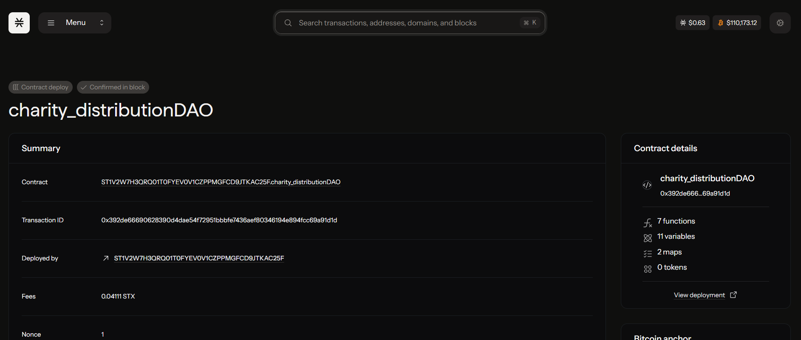

# CharityDistribution DAO

## Project Description

A transparent charity platform with community voting on fund allocation and impact tracking. This decentralized autonomous organization (DAO) enables community members to propose charitable funding initiatives, vote on proposals democratically, and ensure transparent distribution of funds to verified charitable causes.

## Project Vision

Our vision is to revolutionize charitable giving by creating a fully transparent, community-driven platform that eliminates intermediaries and ensures every donation reaches its intended recipient. We aim to build trust in charitable organizations through blockchain technology, enabling donors to track their contributions from submission to impact.

**Core Values:**
- **Transparency**: Every transaction and vote is recorded on the blockchain
- **Democracy**: Community-driven decision making for fund allocation
- **Accountability**: Real-time tracking of fund distribution and impact
- **Efficiency**: Direct fund transfer without intermediary overhead
- **Trust**: Immutable records and smart contract automation

## Key Features

### Core Functions

1. **Create Proposal (`create-proposal`)**
   - Community members can submit funding proposals
   - Includes title, description, recipient, amount, and voting duration
   - Automatically validates proposal against available funds
   - Emits events for transparent tracking

2. **Vote on Proposal (`vote-on-proposal`)**
   - Democratic voting system for fund allocation decisions
   - Prevents double voting with user tracking
   - Time-bound voting periods with automatic deadline enforcement
   - Real-time vote counting and result tracking

### Additional Features
- **Fund Deposits**: Community members can contribute STX to the DAO treasury
- **Proposal Tracking**: Complete history of all proposals and their status
- **Vote Transparency**: Public record of all votes cast by community members
- **Balance Verification**: Real-time tracking of DAO treasury funds

## Technical Architecture

### Smart Contract Components

- **Proposal Management**: Structured storage of funding proposals with metadata
- **Voting Mechanism**: Secure vote recording with anti-fraud measures
- **Fund Tracking**: Transparent treasury management
- **Event Logging**: Complete audit trail of all DAO activities

### Data Structures

- **Proposals Map**: Stores all proposal details including votes and execution status
- **User Votes Map**: Tracks individual votes to prevent manipulation
- **Treasury Variables**: Real-time fund balance and allocation tracking

## Future Scope

### Phase 1: Enhanced Governance
- **Weighted Voting**: Implement voting power based on stake or contribution history
- **Proposal Categories**: Organize proposals by charitable focus areas (education, healthcare, environment)
- **Minimum Threshold**: Automatic execution of proposals meeting vote requirements
- **Veto Powers**: Emergency mechanisms for community protection

### Phase 2: Impact Tracking
- **Milestone Reporting**: Recipients provide progress updates on funded projects
- **Impact Metrics**: Quantifiable measurement of charitable outcomes
- **Photo/Document Verification**: IPFS integration for proof of impact
- **Reputation System**: Track and rate recipient performance over time

### Phase 3: Advanced Features
- **Multi-Token Support**: Accept various cryptocurrencies and tokens
- **Recurring Donations**: Automated monthly/quarterly funding streams
- **Grant Templates**: Pre-approved proposal formats for common charity types
- **Mobile App**: User-friendly interface for proposal creation and voting

### Phase 4: Ecosystem Integration
- **Cross-Chain Compatibility**: Expand to other blockchain networks
- **Partnership Integration**: Connect with existing charitable organizations
- **Tax Optimization**: Integration with tax-deductible donation systems
- **Analytics Dashboard**: Comprehensive reporting and insights platform

### Phase 5: Global Scale
- **Multi-Language Support**: Localization for global community participation
- **Regional DAOs**: Specialized DAOs for specific geographic regions
- **Charity Verification**: KYC/AML compliance for recipient organizations
- **Regulatory Compliance**: Adaptation to various international charitable regulations

## Technology Roadmap

### Smart Contract Enhancements
- Gas optimization for cost-effective operations
- Upgradeability mechanisms for future improvements
- Integration with oracle services for external data
- Advanced security audits and formal verification

### User Experience Improvements
- Intuitive web interface for non-technical users
- Mobile-responsive design for accessibility
- Real-time notifications for proposal updates
- Educational resources for new users

### Integration Capabilities
- API development for third-party integrations
- Webhook support for external systems
- Data export tools for compliance and reporting
- Social media integration for proposal promotion

## Getting Started

### Prerequisites
- Stacks blockchain testnet/mainnet access
- Compatible wallet (Leather, Xverse, etc.)
- Basic understanding of DAO governance principles

### Deployment
1. Deploy the smart contract to Stacks blockchain
2. Initialize with minimum voting threshold parameters
3. Set up initial fund deposits
4. Begin community onboarding and proposal creation

## Contract Address Details
Contract Details: ST1V2W7H3QRQ01T0FYEV0V1CZPPMGFCD9JTKAC25F.charity_distributionDAO

## Contributing

We welcome contributions from the community! Whether you're interested in:
- Smart contract development
- Frontend/backend development
- Community management
- Charitable partnership development
- Documentation and education

---